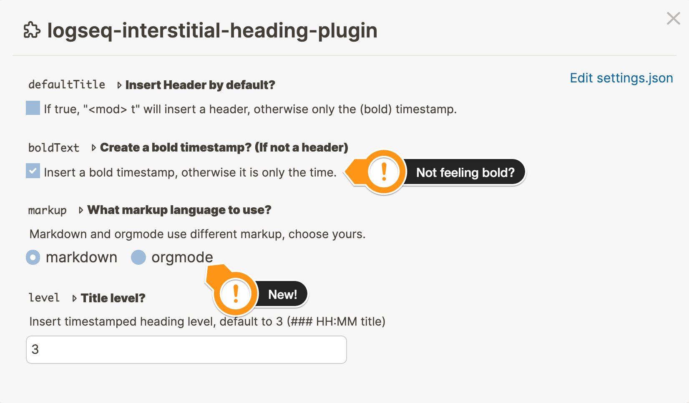
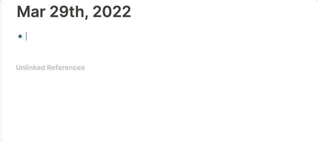

# Logseq Interstitial journaling

<!--
*** Thanks for checking out Unfinished business. If you have a suggestion
*** that would make this better, please fork the repo and create a pull request
*** or simply open an issue with the tag "enhancement".
*** Don't forget to give the project a star!
*** Thanks again! Now go create something AMAZING! :D
-->

<!-- PROJECT SHIELDS -->
<!--
*** I'm using markdown "reference style" links for readability.
*** Reference links are enclosed in brackets [ ] instead of parentheses ( ).
*** See the bottom of this document for the declaration of the reference variables
*** for contributors-url, forks-url, etc. This is an optional, concise syntax you may use.
*** https://www.markdownguide.org/basic-syntax/#reference-style-links
-->
[![latest release version][release-shield]][release-url]
[![Forks][forks-shield]][forks-url]
[![Stargazers][stars-shield]][stars-url]
[![Issues][issues-shield]][issues-url]
[![MIT License][license-shield]][license-url]

> Interstitial journaling is a productivity technique created by Tony Stubblebine. To my knowledge, it’s the simplest way to combine note-taking, tasks, and time tracking in one unique workflow. -- [Interstitial journaling: combining notes, to-do & time tracking - Ness Labs](https://nesslabs.com/interstitial-journaling)

<!-- PROJECT LOGO -->
 

  

<h3 align="center">Logseq Interstitial journaling</h3>

  

    Because your journal is neither foreboding nor an afterthought
     
    <a href="https://github.com/qWxleA/logseq-interstitial-heading-plugin">View Demo</a>
    ·
    <a href="https://github.com/qWxleA/logseq-interstitial-heading-plugin/issues">Report Bug</a>
    ·
    <a href="https://github.com/qWxleA/logseq-interstitial-heading-plugin/issues">Request Feature</a>
  

This plugin helps you quickly create time-stamps, without interupting your thought. As a bonus it can start your day with a quote, or a note to self.

> It is true. I am 217% happier now. 
>
>— <cite>Exited customer</cite>

<!-- TABLE OF CONTENTS -->

  
Table of Contents

  <ol>
    <li><a href="#installation">Installation</a></li>
    <li><a href="#Using the plugin">Using the plugin</a></li>
    <li><a href="#Configuration">Configuration</a></li>
    <li><a href="#license">License</a></li>
    <li><a href="#contact">Contact</a></li>
    <li><a href="#acknowledgments">Acknowledgments</a></li>
  </ol>

## Installation

### Preparation

- Click the 3 dots in the righthand corner and go to **Settings**.
- Go to **Advanced** and enable **Plug-in system**.
- Restart the application.
- Click 3 dots and go to Plugins (or `Esc t p`).

### Install plugin from the Marketplace (recommended) 

- Click the `Marketplace` button and then click `Plugins`.
- Find the plugin and click `Install`.

### Install plugin manually

- Download a released version assets from Github.
- Unzip it.
- Click `Load unpacked plugin`, and select destination directory to the unzipped folder.

## Using the plugin

This plugin makes it *just* a tiny bit easier to use Logseq as an interstitial journal. Two shortcuts that create timestamps, either as a header, or just (bold) text.

Next, it makes it possible to send a note to yourself (write yesterday, see today), or just add a random note to a template.

## Adding timestamps to your journal

- Use `Ctrl-t` to insert a timestamp in the current block/line.
- Use `Ctrl-Shift-t` to insert a timestamped heading in the current block/line.

In the settings you can reverse this, so the default `Ctrl-t` becomes a timestamped heading.

### Configuration

Under settings you can change the default timestamp, and if you want to use *bold* text.

You can choose Markdown or Org-mode, depending on what you use.

The level of the heading, where the timestamp is inserted, defaults to 3 (`### HH:MM <optional title>`)

**New:** It is possible to insert custom markup *around the time*. 

Example: `[<time>]` this wil print: `[20:23]`

Leave blank for default timestamp.

(<a href="#top">back to top</a>)

## Templates

The default way to use the plugin is place one or more *placeholders* in your `daily` template. Then, when the template is run at midnight, a random note and a note to self are block-linked into place.

The plugin gives to commands to insert a "note to self" or a "random quote".

The idea is to put these in a template, and then, when the template is executed, the result will be a linked block to the not e or quote.

Usage:

type: `/Create Note to Self` or `/Create Random Quote`, and it will insert a code-snippet that will then be run with the template.

The default placeholder looks like this: 

- `{{renderer :interstitial, yesterday, ntnds}}`
- `{{renderer :interstitial, random, quote}}`

`yesterday` Will backlink a block from _yesterday_, `random` finds any block in your graph with the specified tag. Next you can alter `ntnds` and `quote`, you can choose any tag you use in your system, these are just the ones I use 😁.

These placeholder are _supposed_ to go in your (daily) template, but they will happily work anywhere you put them. If you put them in a template they will wait running, until the template is activated.

(<a href="#top">back to top</a>)

## Licence

[MIT](.LICENSE.txt)

### Image license

Image from: [flickr](https://www.flickr.com/photos/kotomi-jewelry/33599728252) (the original looks much better)  This image is licensed under a <a rel="license" href="http://creativecommons.org/licenses/by-nc/2.0/">Creative Commons Attribution-NonCommercial 2.0 Generic License</a>.

### Font License

[OFL](./OFL.txt)

(<a href="#top">back to top</a>)

<!-- CONTACT -->
## Contact

Alex Qwxlea - [@twitter_handle](https://twitter.com/QwxleaA) 

Project Link: [https://github.com/QWxleA/logseq-interstitial-heading-plugin](https://github.com/QWxleA/)

(<a href="#top">back to top</a>)

## Acknowledgments

This plugin is a partially is inspired by [Obsidian rollover daily todo](https://github.com/shichongrui/obsidian-rollover-daily-todos), thanks!

<!-- MARKDOWN LINKS & IMAGES -->
<!-- https://www.markdownguide.org/basic-syntax/#reference-style-links -->
[release-url]: (https://github.com/QWxleA/logseq-interstitial-heading-plugin)
[release-shield]: https://img.shields.io/github/v/release/qwxlea/logseq-interstitial-heading-plugin?style=for-the-badge
[contributors-shield]: https://img.shields.io/github/contributors/QWxleA/logseq-interstitial-heading-plugin.svg?style=for-the-badge
[contributors-url]: https://github.com/QWxleA/logseq-interstitial-heading-plugin/graphs/contributors
[forks-shield]: https://img.shields.io/github/forks/QWxleA/logseq-interstitial-heading-plugin.svg?style=for-the-badge
[forks-url]: https://github.com/QWxleA/logseq-interstitial-heading-plugin/network/members
[stars-shield]: https://img.shields.io/github/stars/QWxleA/logseq-interstitial-heading-plugin.svg?style=for-the-badge
[stars-url]: https://github.com/QWxleA/logseq-interstitial-heading-plugin/stargazers
[issues-shield]: https://img.shields.io/github/issues/QWxleA/logseq-interstitial-heading-plugin.svg?style=for-the-badge
[issues-url]: https://github.com/QWxleA/logseq-interstitial-heading-plugin/issues
[license-shield]: https://img.shields.io/github/license/QWxleA/logseq-interstitial-heading-plugin.svg?style=for-the-badge
[license-url]: https://github.com/QWxleA/logseq-interstitial-heading-plugin/blob/master/LICENSE.txt
